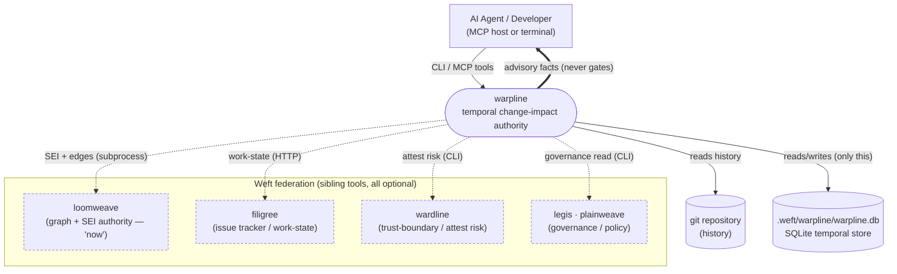
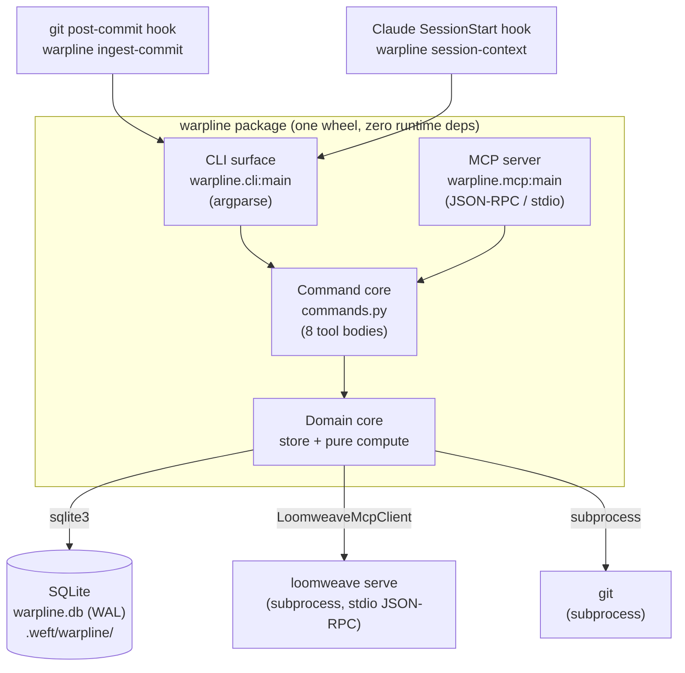
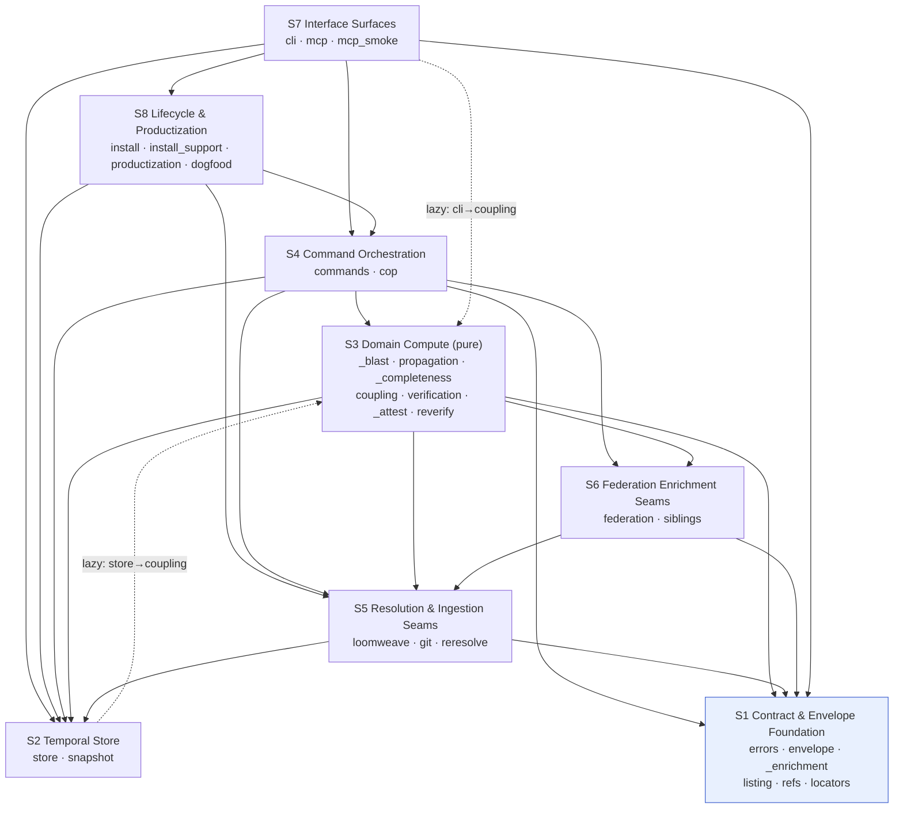
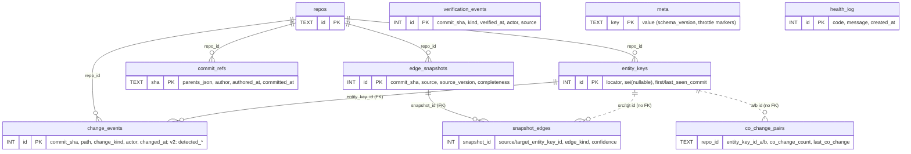
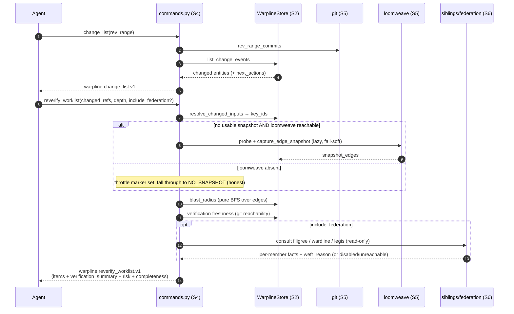

# 03 — Architecture Diagrams

Mermaid diagrams for `warpline` at HEAD `def6d43`. Render in any Mermaid-aware viewer (GitHub, VS Code,
mermaid.live).

---

## C4 L1 — System Context

Where warpline sits in the Weft federation and its environment. warpline is **enrich-only** and
**local-first**: it functions with no sibling present and writes only under `.weft/warpline/`.

*Dashed = optional sibling, consulted only when present; absence is reported explicitly
(`unavailable`), never as a clean state.*

---

## C4 L2 — Containers (process & store boundaries)

warpline ships two executables over one shared core, plus an embedded SQLite store and an isolated
loomweave subprocess.

---

## C4 L3 — Components (the 8 subsystems)

Layered flow toward the foundation; **module-acyclic** (one S2↔S3 back-edge, dotted below). (See
02-subsystem-catalog.md for module membership.)

*S1 (Contract Foundation, highlighted) and S2 (Store) are **parallel** foundations — neither imports
the other; S2 has no module-level internal imports (fan_in 38, fan_out 0), which anchors the graph.
The **dotted edges are the S2↔S3 back-edge**: `store`/`cli` reach into `coupling` (S3) via deferred
function-body imports, so the module graph stays acyclic (`coupling` is a pure leaf) while the
subsystem graph has a real `store`↔`compute` cycle. Verified by `analysis-validator` against the raw
import statements (loomweave's graph omits function-body imports). For readability two real edges are
elided: S7 (Surfaces) also reaches S5/S6 directly, and S8→S7 (`dogfood.py:20` drives `mcp.dispatch`).*

---

## Data model — SQLite schema

8 base tables (`store.py:35-107`) + **2 migration-added tables** (`co_change_pairs` v3,
`verification_events` v4) + v2 anchor *columns* on `change_events`. Note: `co_change_pairs` and
`snapshot_edges` reference `entity_key_id` **without a `FOREIGN KEY`** — integrity is maintained in
application code.

---

## Sequence — the core change → reverify loop

The flow an agent runs before claiming a change is done. Shows the always-on lazy snapshot capture and
the fail-soft sibling consults.

---

## Diagram notes & caveats

- Diagrams reflect `src/` at HEAD `def6d43`; the L3 component graph is derived from import blocks +
  the loomweave edge graph (tombstone `heddle.*` edges excluded).
- The ER diagram simplifies column lists; authoritative DDL is `store.py:35-107` + the `_migrate_v*`
  functions. The `||..o{` (dotted) relations denote integer references **without** a DB-level foreign
  key (a noted fragility — see 02/05).
- The sequence diagram omits the list-ergonomics pipeline (filter/sort/overflow/page) applied to every
  list result and the `build_envelope` step common to all tools.
